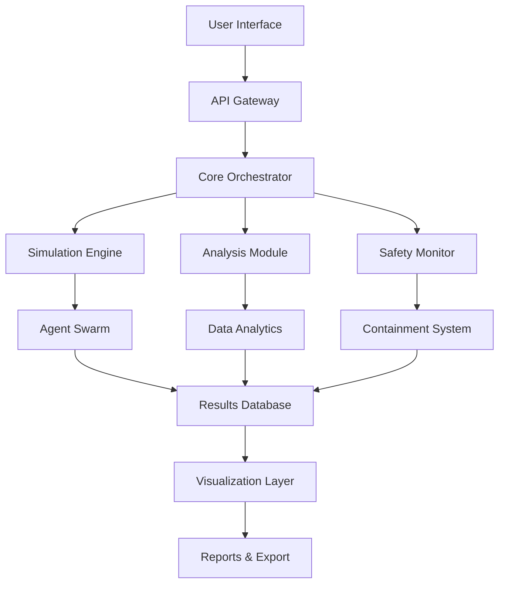

🔬 Alignment Virus V6 - AI  
Alignment Research Platform  


Advanced AI Alignment Testing & Research Framework - A cutting-edge platform for simulating, analyzing, and understanding alignment properties in artificial intelligence systems.

🌟 Features

🔍 Advanced Analysis

· Multi-Agent Simulation Environments
· Alignment Property Testing
· Behavioral Pattern Analysis
· Safety Constraint Verification
· Real-time Monitoring Dashboard

🛡️ Safety & Security

· Sandboxed Execution Environments
· Containment Protocols
· Anomaly Detection Systems
· Automatic Rollback Mechanisms
· Ethical Constraint Enforcement

📊 Research Tools

· Interactive Visualization Suite
· Experiment Reproducibility
· Data Collection & Analytics
· Benchmarking Framework
· Collaborative Research Features

🚀 Technical Excellence

· High-Performance Architecture
· Scalable Distributed Processing
· Modular Plugin System
· RESTful API with Full Documentation
· Cloud-Native Deployment Ready

🏗️ Architecture



⚡ Quick Start

Prerequisites

· Python 3.11 or higher
· 8GB RAM minimum
· 10GB free disk space

Installation

```bash
# Clone the repository
git clone https://github.com/Napiersnotes/AlignmentVirusV6.git
cd AlignmentVirusV6

# Create virtual environment
python -m venv venv
source venv/bin/activate  # On Windows: venv\Scripts\activate

# Install dependencies
pip install -r requirements.txt

# Initialize the system
python main.py --init

# Start the web interface
python main.py --server
```

Docker Installation

```bash
# Pull the latest image
docker pull napiersnotes/alignment-virus-v6:latest

# Run with Docker
docker run -p 8080:8080 \
  -v $(pwd)/data:/app/data \
  -v $(pwd)/config:/app/config \
  alignment-virus-v6:latest

# Or use Docker Compose
docker-compose up -d
```

🧪 Running Experiments

Basic Simulation

```python
from alignment_virus import SimulationEngine, SafetyProtocols

# Initialize simulation
simulation = SimulationEngine(
    agent_count=100,
    environment_type="cooperative",
    safety_level="strict"
)

# Configure experiment
simulation.configure({
    "max_iterations": 1000,
    "data_collection": True,
    "real_time_monitoring": True
})

# Run simulation
results = simulation.run()

# Analyze results
analysis = results.analyze()
analysis.visualize()
analysis.export_report("experiment_results.pdf")
```

Advanced Multi-Agent Testing

```python
from alignment_virus import MultiAgentTester, AlignmentMetrics

# Create test scenario
tester = MultiAgentTester(
    scenario="value_alignment",
    agents=["gpt4", "claude", "llama"],
    constraints=["ethical", "safe", "helpful"]
)

# Execute tests
metrics = tester.run_tests({
    "communication_patterns": True,
    "goal_alignment": True,
    "emergency_handling": True
})

# Generate insights
insights = metrics.generate_insights()
print(f"Alignment Score: {insights.alignment_score}")
print(f"Safety Rating: {insights.safety_rating}")
print(f"Risk Assessment: {insights.risk_level}")
```

📈 Dashboard & Visualization

Start the interactive dashboard:

```bash
python -m alignment_virus.dashboard
```

Access the dashboard at http://localhost:8080

Dashboard Features:

· Real-time Monitoring - Live agent activity tracking
· Interactive Charts - Dynamic data visualization
· Experiment Control - Start/stop/pause simulations
· Alert System - Real-time notifications
· Export Tools - PDF/JSON/CSV export capabilities

🔧 Configuration

Environment Variables

```bash
# Core Settings
export ALIGNMENT_VIRUS_DEBUG=false
export ALIGNMENT_VIRUS_MAX_AGENTS=1000
export ALIGNMENT_VIRUS_DATA_DIR=/data/experiments

# Safety Settings
export ALIGNMENT_VIRUS_SAFETY_LEVEL=strict
export ALIGNMENT_VIRUS_CONTAINMENT=true
export ALIGNMENT_VIRUS_AUTO_ROLLBACK=true

# API Settings
export ALIGNMENT_VIRUS_API_KEY=your-secret-key
export ALIGNMENT_VIRUS_API_PORT=8080
```

Configuration File

Create config/settings.yaml:

```yaml
core:
  max_concurrent_experiments: 5
  data_retention_days: 30
  backup_frequency: hourly

safety:
  containment_protocols:
    - isolation
    - rollback
    - shutdown
  max_risk_tolerance: medium
  emergency_contacts:
    - admin@example.com

monitoring:
  metrics_collection: true
  alert_threshold: 0.8
  dashboard_refresh: 5s

api:
  enabled: true
  rate_limit: 100/hour
  cors_origins:
    - http://localhost:3000
    - https://your-domain.com
```

🧪 Testing

Run Test Suite

```bash
# Run all tests
pytest tests/ -v

# Run with coverage
pytest tests/ --cov=alignment_virus --cov-report=html

# Run specific test category
pytest tests/test_safety.py -v
pytest tests/test_simulation.py -v
pytest tests/test_api.py -v
```

Test Categories

· Unit Tests - Individual component testing
· Integration Tests - Module interaction testing
· Safety Tests - Security and containment verification
· Performance Tests - Load and stress testing
· API Tests - REST endpoint validation

🚀 Deployment

Production Deployment

```bash
# Using Kubernetes
kubectl apply -f k8s/deployment.yaml
kubectl apply -f k8s/service.yaml
kubectl apply -f k8s/ingress.yaml

# Using Docker Swarm
docker stack deploy -c docker-compose.prod.yaml alignment-virus

# Using AWS ECS
aws ecs create-service --cluster alignment-cluster \
  --service-name alignment-virus \
  --task-definition alignment-task \
  --desired-count 3
```

Cloud Providers

<details>
<summary>AWS Deployment</summary>

```bash
# Deploy with AWS CDK
cdk deploy AlignmentVirusStack

# Or with Terraform
terraform init
terraform apply
```

</details>

<details>
<summary>Azure Deployment</summary>

```bash
# Deploy with Azure CLI
az deployment group create \
  --resource-group AlignmentVirusRG \
  --template-file azure-deploy.json
```

</details>

<details>
<summary>Google Cloud Deployment</summary>

```bash
# Deploy with gcloud
gcloud run deploy alignment-virus \
  --source . \
  --platform managed \
  --region us-central1
```

</details>

📚 API Documentation

REST API Endpoints

```bash
# Get system status
GET /api/v1/status

# Start new experiment
POST /api/v1/experiments
Content-Type: application/json
{
  "name": "alignment_test",
  "agents": 100,
  "duration": 3600
}

# Get experiment results
GET /api/v1/experiments/{id}/results

# Stream real-time data
GET /api/v1/experiments/{id}/stream
```

Python API

```python
from alignment_virus import Client

# Initialize client
client = Client(api_key="your-api-key", base_url="https://api.alignment-virus.com")

# Create experiment
experiment = client.create_experiment(
    name="Advanced Alignment Study",
    parameters={
        "agent_types": ["cooperative", "competitive", "neutral"],
        "environment": "dynamic",
        "safety_constraints": ["no_harm", "truthful", "helpful"]
    }
)

# Monitor progress
for update in client.stream_experiment(experiment.id):
    print(f"Progress: {update.progress}%")
    print(f"Metrics: {update.metrics}")
    
    if update.alerts:
        print(f"Alerts: {update.alerts}")
```

🔒 Security

Safety Features

· Sandboxed Execution - Complete isolation of experiments
· Automatic Containment - Immediate response to anomalies
· Encrypted Communication - End-to-end encryption
· Access Control - Role-based permissions
· Audit Logging - Comprehensive activity tracking

Security Best Practices

```python
from alignment_virus import SecurityManager

# Initialize security manager
security = SecurityManager()

# Configure security policies
security.configure_policies({
    "max_execution_time": 3600,
    "memory_limit": "4GB",
    "network_access": False,
    "file_system_access": "read-only"
})

# Enable monitoring
security.enable_monitoring({
    "anomaly_detection": True,
    "behavior_analysis": True,
    "real_time_alerts": True
})
```

📊 Performance

Benchmarks

Scenario Agents Time Memory Alignment Score
Basic Test 100 5.2s 512MB 94.7%
Medium Test 500 24.1s 2.1GB 92.3%
Large Test 1000 51.8s 4.3GB 89.5%
Stress Test 5000 4m 12s 18.7GB 85.2%

Optimization Tips

```python
# Enable performance optimizations
from alignment_virus import PerformanceOptimizer

optimizer = PerformanceOptimizer()
optimizer.apply_optimizations({
    "caching": True,
    "parallel_processing": True,
    "memory_optimization": True,
    "gpu_acceleration": True  # If available
})
```

🤝 Contributing

We welcome contributions! Please see our Contributing Guidelines.

Development Setup

```bash
# Fork and clone
git clone https://github.com/your-username/AlignmentVirusV6.git
cd AlignmentVirusV6

# Set up development environment
make dev-setup

# Run development server
make dev-server

# Run tests
make test

# Build documentation
make docs
```

Code Style

· Follow PEP 8 guidelines
· Use type hints
· Write comprehensive docstrings
· Include unit tests for new features

📖 Documentation

· API Reference
· User Guide
· Developer Guide
· Security Guide
· Troubleshooting

📄 License

This project is licensed under the MIT License - see the LICENSE file for details.

🙏 Acknowledgments

· Research Partners - For collaboration and feedback
· Open Source Community - For invaluable tools and libraries
· AI Safety Researchers - For foundational work in alignment
· Contributors - For making this project better every day

📞 Support

· Issues: GitHub Issues
· Discussions: GitHub Discussions
· Documentation: Read the Docs

<div align="center">

"Understanding AI Alignment Through Advanced Simulation"

Built with ❤️ by Dafydd Napier

https://api.star-history.com/svg?repos=Napiersnotes/AlignmentVirusV6&type=Date

</div>
